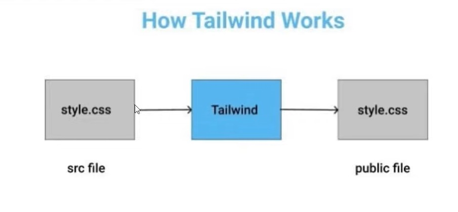

##
### TAILWIND CSS - BREVE INTRODUÇÃO
##


**Tailwind CSS** é uma estrutura CSS de código aberto. A principal característica desta *biblioteca* é que, ao contrário de outros **frameworks CSS** como o Bootstrap, ela não fornece uma série de classes predefinidas para elementos como botões ou tabelas


- Tailwind CSS
    - Site: https://tailwindcss.com/
- Bootstrap
    - Site: https://getbootstrap.com/


**Instalando o Tailwind CSS**

- Instalar o NodeJS
- NodeJS
    - Site: https://nodejs.org/en

- TailwindCSS
    - Site: https://tailwindcss.com/docs/installation

- Instalar no terminal no vscode

```
npm install -D tailwindcss
```

- Iniciar o TailwindCSS (Criar o arquivo `tailwind.config.js`)

```
npx tailwindcss init
```

- Comando
```
npx tailwindcss -i ./src/input.css -o ./app/assets/css/app.css --watch
```

**Text Color**

- https://tailwindcss.com/docs/text-color

**Center Text**

- https://tailwindcss.com/docs/text-align#setting-the-text-alignment


### ____________________________________________________________________________________________


##
### TailwindCSS Para Iniciantes
##


### 1 - INTRODUÇÃO

**TailwindCSS**


**O que é o tailwindcss?**

- É uma *framework* de CSS baseada no conceito utility-first
- É diferente do Bootstrap, MaterialUI, etc...
- Essas bibliotecas são mais "opinativas"
- O tailwindcss aplica várias classes no mesmo elemento


- Tailwind CSS
    - Site: https://tailwindcss.com/


**Instalação do Tailwind CLI**

- Instalar o NodeJS

- NodeJS
    - Site: https://nodejs.org/en


- Verificar a versão do nodejs instalado (terminal)

```
node -v
```

- Instalar o tailwindcss
    - Site: https://tailwindcss.com/docs/installation


- Passo 1 - Comando (terminal)

```
npm install tailwindcss
```

- Exemplo
    - tailwind_css-01


### 2 - CÓDIGO GENÉRICO DO SISTEMA E DUAS EXTENSÕES

<p align="center">
  
</p>


- Passo 1 
- Inicia o Tailwind no projeto (terminal) (`tailwind.config.js`)
```
npx tailwindcss init 
```

**Utility-First Fundamentals**

- Utility-First: https://tailwindcss.com/docs/utility-first

- Extenção VSCode
    - `Live Server`
    - settings/full reload/checked
    - `Tailwind CSS IntelliSense`
`

- Exemplo
    - tailwind_css-02


### 3 - ORGANIZAÇÃO DO PROJETO INICIAL E TAILWIND CONFIG


- Functions and Directives:
    - Link: https://tailwindcss.com/docs/functions-and-directives


- Passo 2
- `tailwind.config.js`
```
'./build/*.html'
```

- Passo 3 
    Link - https://tailwindcss.com/docs/installation

- Passo 4
```
npx tailwindcss -i ./src/input.css -o ./build/assets/css/app.css --watch
```


- Exemplo
    - tailwind_css-03


